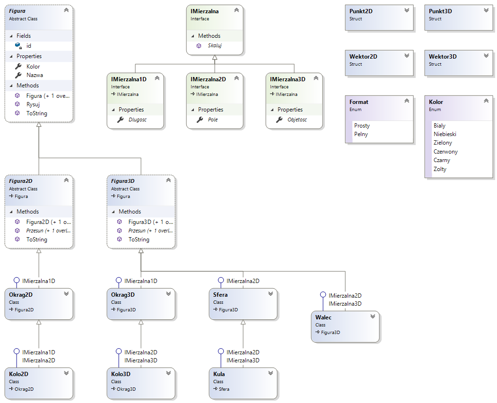

### Figury mierzalne - hierarchia klas i interfejsów (7 pkt.)

> Autor: _Krzysztof Molenda_
> 
> Wersja: 1.2 (2019.09.01)

Planujesz stworzyć aplikację typu edytor graficzny (dla 2 i 3 wymiarów, podobnie jak Paint3D w Windows 10 czy Geogebra).

Zaczynasz od zbudowania hierarchii klas i interfejsów dla Twojej aplikacji. Pracujesz w .NET Framework 4.7.3 lub .NET Core 2.x (C# 7).

Aktualny stan Twojego projektu przedstawia diagram:



Hierarchię klas implementujesz w przestrzeni nazw `FiguryLib`.

Koncepcja biblioteki klas opiera się na założeniu:

* Figury mogą być reprezentowane (rysowane) w przestrzeni 2- oraz 3-wymiarowej, np. koło - jako figura płaska - może być również umieszczone w 3D.

* Figury mogą być mierzalne. W zależności od wymiaru figury mogą być mierzalne:
  * w jednym wymiarze - czyli mieć długość (odcinek, okrąg, spirala, ...)
  * w dwóch wymiarach - czyli mieć obwód i powierzchnię (figury zamknięte płaskie, np. koło, kwadrat)
  * w trzech wymiarach - czyli nie mieć długości, ale mieć pole powierzchni (np. sfera) i/lub objętość (np. kula).

Twój projekt składa się hierarchii interfejsów:

```csharp
//file: IMierzalna.cs

namespace FiguryLib
{
    /// <summary>
    /// Figury mierzalne można skalować,
    /// czyli proporcjonalnie zmieniać ich rozmiar
    /// </summary>
    public interface IMierzalna
    {
        /// <summary>
        /// Zmienia rozmiar figury.
        /// </summary>
        /// <param name="wspSkalowania"> dodatnia wartość rzeczywista</param>
        void Skaluj(double wspSkalowania);
    }

    /// <summary>
    /// Figurami mierzalnymi w 1D są takie figury, które po ewentualnym rozcięciu
    /// można "umieścić" na osi (miara liniowa).
    /// Przykładami takich figur są m.in. odcinek, łamana, okrąg (ale nie koło), ... - umieszczone
    /// zarówno w 2D jak i w 3D, np. spirala przestrzenna
    /// </summary>
    public interface IMierzalna1D : IMierzalna
    {
        /// <summary>Zwraca rozmiar figury w 1D - zwyczajowa nazwa: długość</summary>
        double Dlugosc { get; }
    }

    /// <summary>
    /// Figury mierzalne w 2D - figury zamknięte, mające pole powierzchni.
    /// Przykładami takich figur są m.in. koło, prostokąt, trójkąt - umieszczone zarówno w 2D jak i w 3D lub np. sfera.
    /// Zwyczajowo, dla takich figur, nazwą miary powierzchniowej jest "pole".
    /// </summary>
    public interface IMierzalna2D : IMierzalna
    {
        /// <summary>Zwraca rozmiar powierzchniowy figury w 2D</summary>
        double Pole { get; }
    }

    /// <summary>
    /// Figury mierzalne w 3D - figury zamknięte, mające dodatkowo objętość.
    /// Przykładami takich figur są m.in. kula, prostopadłościan, ostrosłup, ...
    /// Przyjmujemy, że miara liniowa figury 3D zawsze wynosi 0.
    /// Figury 2D umieszczone w 3D maja objętość 0.
    /// </summary>
    public interface IMierzalna3D : IMierzalna
    {
        double Objetosc { get; }
    }
}
```

Dodatkowo, w pliku `Utility.cs` znajdują się niewielkie klasy i struktury pomocnicze
  
```csharp
//file: Utility.cs

namespace FiguryLib
{
    public enum Kolor { Bialy, Niebieski, Zielony, Czerwony, Czarny, Zolty }

    public enum Format { Prosty, Pelny };

    public struct Punkt2D
    {
        public static readonly Punkt2D ZERO = new Punkt2D(0, 0);
        public readonly double X;
        public readonly double Y;
        public Punkt2D(double x = 0, double y = 0) { X = x; Y = y; }
        public override string ToString() => $"({X}; {Y})";
    }

    public struct Punkt3D
    {
        public static readonly Punkt3D ZERO = new Punkt3D(0, 0, 0);
        public readonly double X;
        public readonly double Y;
        public readonly double Z;
        public Punkt3D(double x = 0, double y = 0, double z = 0) { X = x; Y = y; Z = z; }
        public override string ToString() => $"({X}; {Y}; {Z})";
    }

    public struct Wektor2D
    {
        public readonly double X;
        public readonly double Y;
        public Wektor2D(double x = 0, double y = 0) { X = x; Y = y; }
        public override string ToString() => $"[{X}; {Y}]";
        public double[] ToArray() => new double[2] { X, Y };
    }

    public struct Wektor3D
    {
        public readonly double X;
        public readonly double Y;
        public readonly double Z;
        public Wektor3D(double x = 0, double y = 0, double z = 0) { X = x; Y = y; Z = z; }
        public override string ToString() => $"[{X}; {Y}]";
        public double[] ToArray() => new double[3] { X, Y, Z };
    }
}
```

Podstawą hierarchii klas aktualnie są klasy abstrakcyjne: `Figura` i dziedziczące z niej `Figura2D` oraz `Figura3D`:

```csharp
//file: Figura.cs
using System;

namespace FiguryLib
{
    public abstract class Figura
    {
        private static long id = 0;
        public string Nazwa { get; set; }
        public Kolor Kolor { get; set; }
        public Figura(Kolor kolor = Kolor.Czarny)
        {
            id++;
            Nazwa = $"f{id}";
            Kolor = kolor;
        }

        public Figura(string nazwa ="", Kolor kolor = Kolor.Czarny) : this(kolor)
        {
            Nazwa = (nazwa != "") ? nazwa : "f" + id;
        }

        public virtual void Rysuj() => Console.WriteLine(this);
        public override string ToString() => $"Nazwa: {Nazwa}, kolor: {Kolor}, Figura";
    }

    public abstract class Figura2D : Figura
    {
        public Figura2D() : base(Kolor.Czerwony) { }
        public Figura2D(string nazwa = "", Kolor kolor = Kolor.Czerwony) : base(nazwa, kolor) { }
        public abstract void Przesun(double dx, double dy);
        public abstract void Przesun(Wektor2D kierunek);
        public override string ToString() => $"{base.ToString()}-2D";
    }

    public abstract class Figura3D : Figura
    {
        public Figura3D() : base(Kolor.Niebieski) { }
        public Figura3D(string nazwa = "", Kolor kolor = Kolor.Niebieski) : base(nazwa, kolor) { }
        public abstract void Przesun(double dx, double dy, double dz);
        public abstract void Przesun(Wektor3D kierunek);
        public override string ToString() => $"{base.ToString()}-3D";
    }
}
```

Tak przyjęta koncepcja pozwala na rozdzielenie funkcjonalności rysowania figur w różnych układach współrzędnych (2D, 3D) od funkcjonalności mierzenia.

___

#### Polecenie

Twoim głównym zadaniem będzie dodanie brakującego kodu tak, aby spełnione zostały podane wymagania.

1. Utwórz projekt, utwórz wymaganą strukturę projektu i pliki (sugeruj się diagramem), skopiuj do nich podany wcześniej kod. Tego kodu nie możesz zmieniać.

2. Utwórz klasę `Kolo2D` i skopiuj do niej poniższy kod. Kodu tego też nie możesz zmieniać.

```csharp
using System;

namespace FiguryLib
{
    /// <summary>
    /// Koło2D o środku O i promieniu R. Obiekty są mutable.
    /// </summary>
    public class Kolo2D : Okrag2D, IMierzalna1D, IMierzalna2D
    {
        public Kolo2D() : base() { }
        public Kolo2D(Punkt2D srodek, double promien = 0, string nazwa = "") : base(srodek, promien, nazwa)
        {
            R = promien;
            O = srodek;
        }
        public double Pole => Math.PI * R*R;
        public double Obwod => Dlugosc;
        public override string ToString() => $"Kolo2D({O}, {R})";

        public override string ToString(Format format)
            => (format is Format.Prosty) ?
                  this.ToString()
                : base.ToString(format).Replace("Długość", "Obwód") + $", Pole = {Pole:0.##}";
    }
}
```

3. Utwórz brakującą klasę `Okrag2D` - utwórz jej kod tak, aby w klasie `Kolo2D` nie pojawiały się błędy oraz aby podany poniżej program wykonywał się bez błędów. Nie możesz zmieniać kodu programu. Koniecznym będzie również utworzenie dwóch metod rozszerzających - konwertujących `Okrag2D` na `Kolo2D` i odwrotnie.

    **Ważne**: tworząc kod sugeruj się diagramem klas, wykorzystuj maksymalnie mechanizmy programowania obiektowego, łącz kod dla podobnych funkcjonalności.

```csharp
using FiguryLib;

namespace Figury
{
    class Program
    {
        static void Main(string[] args)
        {
            Console.WriteLine("--- Proste testy konstrukcji i modyfikacji: Okrag2D");
            Okrag2D o1 = new Okrag2D();
            Console.WriteLine(o1);
            o1.Rysuj();
            Console.WriteLine(o1.ToString(Format.Pelny));
            o1.Nazwa = "o1";
            o1.O = new Punkt2D(2, 2);
            o1.R = 2;
            Console.WriteLine(o1.ToString(Format.Pelny));

            Console.WriteLine("\n--- Proste testy: Kolo2D");
            Kolo2D k1 = new Kolo2D(srodek: new Punkt2D(1,1), promien: 2 );
            k1.Rysuj();
            Console.WriteLine(k1.ToString(Format.Pelny));

            Console.WriteLine("--- --- rzutowanie koła na okrąg");
            Okrag2D o2 = (Okrag2D)k1;
            Console.WriteLine(o2.ToString(Format.Pelny));

            Console.WriteLine("--- --- konwersja koła na okrąg");
            Okrag2D o2_1 = k1.ToOkrag2D();
            Console.WriteLine(o2_1.ToString(Format.Pelny));

            Console.WriteLine("--- --- konwersja okręgu na koło");
            Kolo2D k2 = o1.ToKolo2D();
            Console.WriteLine(k2.ToString(Format.Pelny));

            Console.WriteLine("--- --- przesuwanie, skalowanie");
            k2.Przesun(1, 1);
            Console.WriteLine($"Po przesunięciu {k2.Nazwa}: {k2.ToString(Format.Pelny)}");

            k2.Skaluj(2);
            Console.WriteLine($"Po skalowaniu {k2.Nazwa}: {k2.ToString(Format.Pelny)}");


            Console.WriteLine("\n--- Proste testy: Sfera, Kula");
            Sfera s1 = new Sfera(new Punkt3D(1, -1, 0), promien: 2);
            Console.WriteLine( s1.ToString(Format.Pelny) );
            Kula ku1 = new Kula();
            Console.WriteLine(ku1.ToString(Format.Pelny));
            ku1.R = 3;
            ku1.Rysuj();

            Kula ku2 = new Kula( srodek: Punkt3D.ZERO, promien: 1);
            Sfera s2 = ku2.ToSfera(); //konwersja kuli na sferę
            s2.R = 2;
            Console.WriteLine(s2.ToString(Format.Pelny));
            var ku3 = s2.ToKula(); //konwersja sfery na kulę

            var o3 = (Okrag2D)s2; //rzutowanie sfery na okrąg
            Console.WriteLine(o3.ToString(Format.Pelny));

            var o4 = (Okrag2D)ku2; //rzutowanie kuli na okrąg
            Console.WriteLine(o4.ToString(Format.Pelny));

            var k3 = (Kolo2D)ku2; //rzutowanie kuli na koło
            Console.WriteLine(o4.ToString(Format.Pelny));

            Console.WriteLine("\n ** Lista Figur **");
            List<Figura> lista = new List<Figura> { o1, k1, o2, o2_1, k2, s1, ku1, ku2, s2, ku3, o3, o4, k3 };
            foreach (var x in lista)
                x.Rysuj();

            Console.WriteLine($"Średnia długość figur = ... ");
            Console.WriteLine($"Sumaryczne pole figur = ... ");
            Console.WriteLine($"Objętość figury największej = ... ");
        }
    }
}
```

Wynik wykonania programu:

```plaintext
--- Proste testy konstrukcji i modyfikacji: Okrag2D
Okrag2D((0; 0), 0)
Okrag2D((0; 0), 0)
Nazwa: f1, kolor: Czerwony, Figura-2D, Okrag2D((0; 0), 0), Długość = 0
Nazwa: o1, kolor: Czerwony, Figura-2D, Okrag2D((2; 2), 2), Długość = 12,57

--- Proste testy: Kolo2D
Kolo2D((1; 1), 2)
Nazwa: f2, kolor: Czerwony, Figura-2D, Kolo2D((1; 1), 2), Obwód = 12,57, Pole = 12,57
--- --- rzutowanie koła na okrąg
Nazwa: f2, kolor: Czerwony, Figura-2D, Kolo2D((1; 1), 2), Obwód = 12,57, Pole = 12,57
--- --- konwersja koła na okrąg
Nazwa: f3, kolor: Czerwony, Figura-2D, Okrag2D((1; 1), 2), Długość = 12,57
--- --- konwersja okręgu na koło
Nazwa: f4, kolor: Czerwony, Figura-2D, Kolo2D((2; 2), 2), Obwód = 12,57, Pole = 12,57
--- --- przesuwanie, skalowanie
Po przesunięciu f4: Nazwa: f4, kolor: Czerwony, Figura-2D, Kolo2D((3; 3), 2), Obwód = 12,57, Pole = 12,57
Po skalowaniu f4: Nazwa: f4, kolor: Czerwony, Figura-2D, Kolo2D((3; 3), 8), Obwód = 50,27, Pole = 201,06

--- Proste testy: Sfera, Kula
Nazwa: f5, kolor: Niebieski, Figura-3D, Sfera((1; -1; 0), 2), Pole = 50,2654824574367
Nazwa: f6, kolor: Niebieski, Figura-3D, Kula((0; 0; 0), 0), Pole = 0, Objętość = 0
Kula((0; 0; 0), 3)
Nazwa: f8, kolor: Niebieski, Figura-3D, Sfera((0; 0; 0), 2), Pole = 50,2654824574367
Nazwa: f10, kolor: Czerwony, Figura-2D, Okrag2D((0; 0), 2), Długość = 12,57
Nazwa: f11, kolor: Czerwony, Figura-2D, Okrag2D((0; 0), 1), Długość = 6,28
Nazwa: f11, kolor: Czerwony, Figura-2D, Okrag2D((0; 0), 1), Długość = 6,28

 ** Lista Figur **
Okrag2D((2; 2), 2)
Kolo2D((1; 1), 2)
Kolo2D((1; 1), 2)
Okrag2D((1; 1), 2)
Kolo2D((3; 3), 8)
Sfera((1; -1; 0), 2)
Kula((0; 0; 0), 3)
Kula((0; 0; 0), 1)
Sfera((0; 0; 0), 2)
Kula((0; 0; 0), 2)
Okrag2D((0; 0), 2)
Okrag2D((0; 0), 1)
Kolo2D((0; 0), 1)
Średnia długość figur = 15,71
Sumaryczne pole figur = 505,8
Objętość figury największej = 113,1
```

4. Wzorując się na gałęzi `Figura2D` opracuj klasy: `Sfera` oraz `Kula` (dziedzicząca z klasy `Sfera`) i umieść w gałęzi `Figura3D`. Sugeruj się diagramem. Dodaj metody rozszerzające te klasy i konwertujące obiekty między sobą (`ToKula()`, `ToSfera()`).

5. W klasie `Sfera` zaimplementuj jawny operator rzutowania sfery na `Okrag2D` - odcinający współrzędną `Z`.

6. Analogicznie, w klasie `Kula` zaimplementuj jawny operator rzutowania kuli na `Okrag2D` oraz na `Kolo2D` - odcinający współrzędną `Z`.

6. Do końcówki programu dopisz kod obliczający i wypisujący średnią długość, sumaryczne pole figur oraz maksymalną objętość figury spośród tych zapisanych na liście.

___

⚠️ Ocenie podlega kompletność i jakość kodu (w szczególności nie powielanie kodu, łączenie kodu, wykorzystanie mechanizmów dziedziczenia).